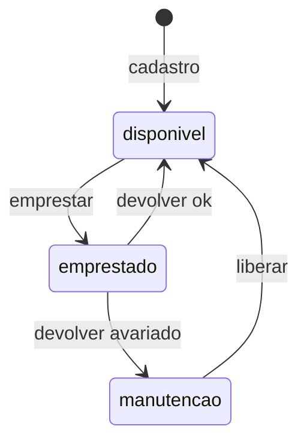

## Máquina de estados

```mermaid
stateDiagram-v2
    [*] --> disponivel : cadastro
    disponivel --> emprestado : emprestar
    emprestado --> disponivel : devolver ok
    emprestado --> manutencao : devolver avariado
    manutencao --> disponivel : liberar
```

